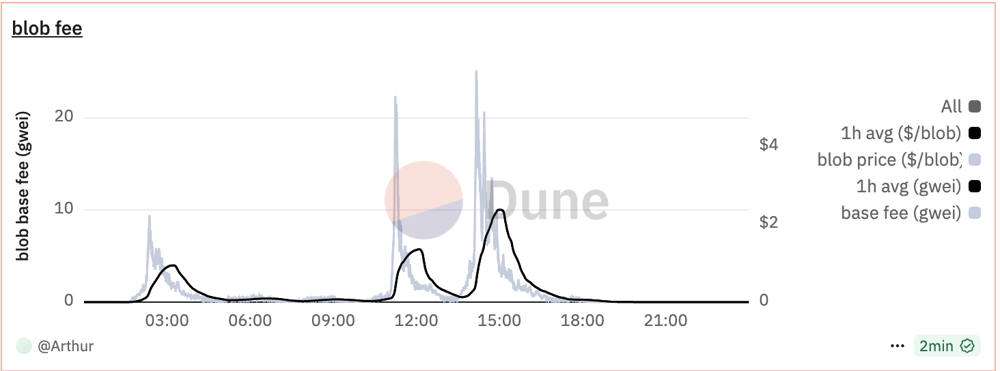
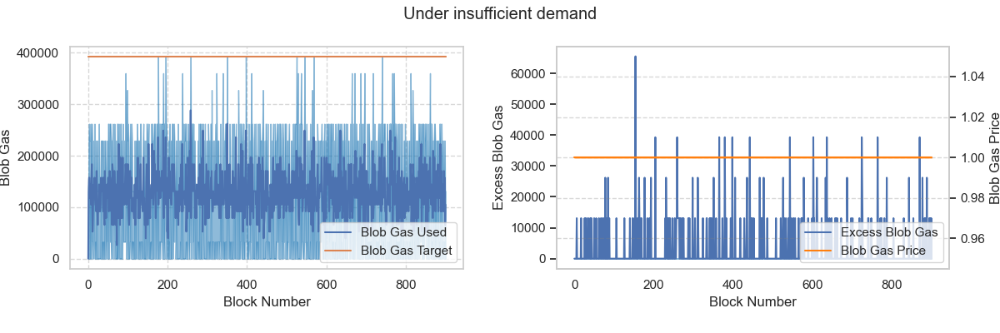
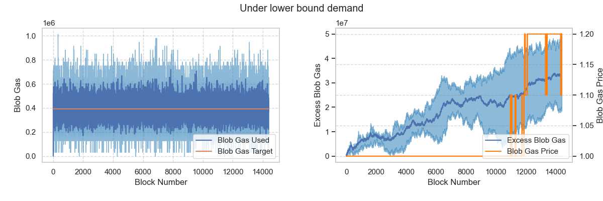
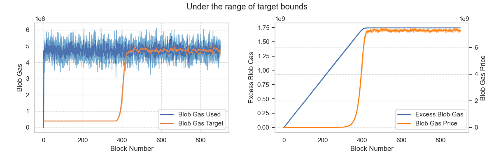
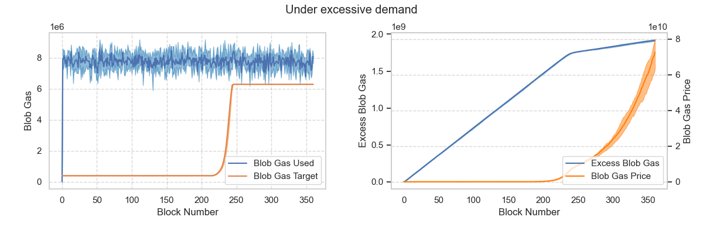
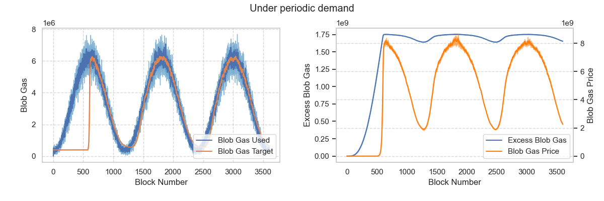
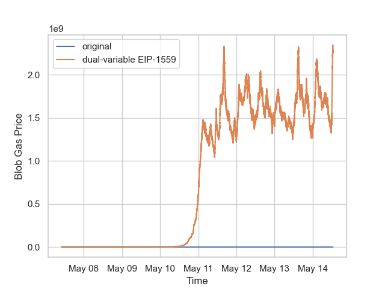

# Maintaining Effective Blob Fee Markets During Network Scaling: Dual-Variable EIP-1559

> Thanks to [Shao](https://x.com/tienshaoku), [Chih Cheng Liang](https://x.com/ChihChengLiang), [Panta Rhei](https://x.com/0xpantarhei) for feedback and discussions.

## Abstract

Ethereum is entering a period of massive network capacity scaling. With the launch of PeerDAS in the Fusaka fork, blob capacity will scale up to 48/72 as planned. However, blob demand growth is not keeping pace with supply capacity, creating an oversupply situation that renders the blob fee market ineffective for extended periods.

This proposal introduces a dual-variable resource pricing mechanism as an extension of EIP-1559, which dynamically adjusts both the `base_fee_per_blob_gas` and `target_blob_gas_per_block` in response to real-world demand fluctuations. This approach stabilizes blob fees and ensures the blob fee market remains effective throughout network scaling phases.

## Motivation

Current resource fees on Ethereum fluctuate with network congestion, rising during congestion and falling during low usage periods. In efficient markets, resource scarcity drives prices to match supply and demand. However, when we scale network capacity by increasing resource targets and limits, the lack of scarcity causes oversupply situation. Since demand doesn't rise to the level of new target accordingly, prices no longer reflect market equilibrium and become ineffective. We’ve seen signs of this imbalance in blob usage over the past year:

1. Blob usage remains below the target most of the time. In practice, demand doesn't immediately respond to supply changes. Blob demand grows gradually, and it still takes time to reach target consumption levels. Until then, `base_fee_per_blob_gas` remains almost free.

    

2. The `base_fee_per_blob_gas` becomes highly volatile when demand approaches the target level. Since the price starts at just 1 wei, even small fluctuations in blob gas usage can cause dramatic price swings. This volatility is pronounced particularly because the market is dominated by a few major consumers, whose high blob gas usage tends to cluster during the same periods, further amplifying price fluctuations and reducing predictability.

    The figure below illustrates these base fee fluctuations on May 5, 2025, before the Pectra fork. The data shows three price spikes, while fees remained nearly free for most of the time period.

    

3. Every time we scale up `target_blob_gas_per_block`, `base_fee_per_blob_gas` drops to 1 wei again. This means we face issues (1) and (2) repeatedly. When [PeerDAS](https://eips.ethereum.org/EIPS/eip-7594) and [BRO](https://eips.ethereum.org/EIPS/eip-7892) are launched, we can expect `base_fee_per_blob_gas` to remain effectively zero for quite a long time.

## Dual-variable EIP-1559 Mechanism

The current blob base fee is calculated as follows:

$$b_{n+1}=b_n∗exp(\frac{g_i−T}{8T})$$

Where $b_n$ is the current block’s base fee, $b_{n+1}$ is the next block’s base fee, $g_i$ is current gas used, and $T$ is the target blob gas fixed at 6. See [this](https://notes.ethereum.org/@vbuterin/proto_danksharding_faq#How-does-the-exponential-EIP-1559-blob-fee-adjustment-mechanism-work) for more details.

We propose making target blob gas a variable to dynamically adjust both the base fee ($b_i$) and target ($t_i$). This mechanism serves the following purposes:

1. Regulates blob gas usage around the target, which represents sustained capacity that the network can handle comfortably for a long time.
2. The base fee still serves as a reserve price based on network congestion.
3. Stabilizes the base fee when the network scales blob capacity.

### Base Fee Adjustment

The purpose of adjusting the base fee is to regulate gas usage around the gas target. Like the original EIP-1559, the adjustment rule computes the base fee ($b_i$) for the current block from the base fee ($b_{i-1}$), gas target ($t_{i-1}$), and gas used ($g_{i-1}$) of the previous block using the equation, where $K_b$ denotes the adjust rate per unit of excess gas:

$$b_{i+1} = b_i \, (1 + K_b \times (g_i - t_i))$$

We can transform this equation to exponential form (see [Dankrad Feist's post](https://dankradfeist.de/ethereum/2022/03/16/exponential-eip1559.html) for the complete derivation):

$$b_n = b_0 \, \exp(K_b \sum_{i=0}^{n-1} g_i - t_i)$$

Even though the target is a variable instead of a fixed number, the formula remains the same as the original one. By definition, $K_b = \frac{1}{\text{Base Fee Update Fraction}}$ and $\sum_{i=0}^{n-1} g_i - t_i = \text{Excess Blob Gas}$. Therefore, we do not need to change any existing implementation.

### Base fee sensitivity

The adjustment rate per unit of excess blob gas ($K_b$) provides a convenient approach to consider base fee sensitivity. In [EIP-7691](https://eips.ethereum.org/EIPS/eip-7691), the new target-to-max ratio of 2:3 disrupts the symmetrical responsiveness between full and empty blob usage scenarios. This asymmetry causes `base_fee_per_blob_gas` to increase by approximately 8.2% under full blob usage while decreasing by approximately 14.5% under empty blob usage.

Rather than focusing on whether responsiveness to full versus empty blob usage is symmetrical, we can redefine symmetrical responsiveness as applying the same percentage adjustment for equivalent changes in excess gas, regardless of whether excess gas increases or decreases. This approach ensures that base fee sensitivity remains consistent under dynamic target conditions.

We propose to restore 12.5% as the maximum rate of change for the base fee and calculates $K_b$ using the following formula:

$$\exp(K_b \times \max(abs(g_i - t_i))) \approx 1.125$$

### Target Adjustment

The purpose of adjusting the target is to alleviate base fee volatility ($\Delta b = b_{i+1} - b_i$). Since the target represents a dynamic range of sustained capacity, when demand falls within this range, the target adapts to maintain stable fees, ensuring that the network can handle varying usage patterns without excessive volatility.

The target for the current block can be computed using the following equation, where $K_t$ denotes the adjust rate per unit:

$$t_{i+1} = t_i(1 + K_t \times (\Delta b - 0))$$

Transforming this equation to exponential form:

$$t_n = t_0 \exp(K_t \sum_{i=0}^{n-1} \Delta b) = t_0 \exp(K_t \times (b_n - b_0))$$

The target variable has a constraint defined as follows:

$$t_i \in [t_{min}, t_{max}]$$

For convenience, we can define reference base fees at `MIN_TARGET_BLOBS_PER_BLOCK` and `MAX_TARGET_BLOBS_PER_BLOCK`. The adjustment rate per unit of price change ($K_t = \frac{1}{\text{Target Blob Update Fraction}}$) can be computed using the formula:

$$K_t = \dfrac{\ln{\dfrac{t_\text{max}}{t_\text{min}}}}{b_\text{max target} - b_\text{min target}}$$

### Mathematical Model

The specific adjustment rules in the dual-variable EIP-1559 mechanism compute the base fee and target using only these formulas:

$$b_n = b_0 \, \exp(K_b \sum_{i=0}^{n-1} g_i - t_i)$$
$$t_n = t_0 \exp(K_t \times (b_n - b_0))$$

The key points about this model are:

- The base fee moves upward or downward whenever the blob gas used is greater or smaller than the target blob gas, respectively.
- The target is not a fixed number. Instead, it changes dynamically based only on the current base fee.

The figure below demonstrates a supply curve with supply elasticity, where capacity respond dynamically to the current price rather than maintaining a fixed target.


### Parameters

New parameters introduced in this proposal include:
• `MIN_TARGET_BLOBS_PER_BLOCK`
• `MAX_TARGET_BLOBS_PER_BLOCK`
• `MIN_TARGET_BLOB_GAS_PER_BLOCK`
• `MAX_TARGET_BLOB_GAS_PER_BLOCK`
• `BASE_FEE_AT_MIN_TARGET_BLOBS`
• `BASE_FEE_AT_MAX_TARGET_BLOBS`
• `TARGET_BLOB_UPDATE_FRACTION`

## Simulation Analysis

For the following simulation analysis, these parameters are set as follows:

```py
MIN_TARGET_BLOBS_PER_BLOCK = 3
MAX_TARGET_BLOBS_PER_BLOCK = 48
MAX_BLOBS_PER_BLOCK = 72
BASE_FEE_AT_MIN_TARGET_BLOBS = 1_000_000_000
BASE_FEE_AT_MAX_TARGET_BLOBS = 8_000_000_000

GAS_PER_BLOB = 2**17
MIN_TARGET_BLOB_GAS_PER_BLOCK = MIN_TARGET_BLOBS_PER_BLOCK * GAS_PER_BLOB
MAX_TARGET_BLOB_GAS_PER_BLOCK = MAX_TARGET_BLOBS_PER_BLOCK * GAS_PER_BLOB
MAX_BLOB_GAS_PER_BLOCK = MAX_BLOBS_PER_BLOCK * GAS_PER_BLOB

MAX_EXCESS_BLOB_GAS_PER_BLOCK = max(
  MAX_BLOB_GAS_PER_BLOCK - MIN_TARGET_BLOB_GAS_PER_BLOCK,
  MAX_BLOB_GAS_PER_BLOCK - MAX_TARGET_BLOB_GAS_PER_BLOCK,
  MIN_TARGET_BLOB_GAS_PER_BLOCK - 0,
  MAX_TARGET_BLOBS_PER_BLOCK - 0,
  0
)

BLOB_BASE_FEE_UPDATE_FRACTION = int(MAX_EXCESS_BLOB_GAS_PER_BLOCK / np.log(1.125))

TARGET_BLOB_UPDATE_FRACTION = int((BASE_FEE_AT_MAX_TARGET_BLOBS - BASE_FEE_AT_MIN_TARGET_BLOBS) / np.log(MAX_TARGET_BLOBS_PER_BLOCK / MIN_TARGET_BLOBS_PER_BLOCK))
```

### Scenario 1: Blob demand is below the minimum target

Assuming average demand is around 2 blobs, which is below `MIN_TARGET_BLOBS_PER_BLOCK`, representing an oversupply situation. The results show that the base fee remains at `MIN_BASE_FEE_PER_BLOB_GAS` wei as expected.



### Scenario 2: Blob demand is around the minimum target

Assuming average demand is around 3 blobs, which equals `MIN_TARGET_BLOBS_PER_BLOCK`. The results show that excess blob gas starts accumulating and the base fee rises above `MIN_BASE_FEE_PER_BLOB_GAS`.



### Scenario 3: Blob demand is between the minimum and maximum targets

Assuming average demand is around 36 blobs, which falls between `MIN_TARGET_BLOBS_PER_BLOCK` and `MAX_TARGET_BLOBS_PER_BLOCK`. The results show that it takes approximately 400 blocks for the target blob to adjust and track actual demand. The base fee remains stable when the market reaches equilibrium.



### Scenario 4: Blob demand is around the maximum target

Assuming average demand is around 48 blobs, which equals `MAX_TARGET_BLOBS_PER_BLOCK`. The results show that it takes approximately 300 blocks for the target blob to reach `MAX_TARGET_BLOBS_PER_BLOCK`. After that, the base fee is governed by the original EIP-1559 price update function.


### Scenario 5: Blob demand is above the maximum target

Assuming average demand is around 60 blobs, which exceeds `MAX_TARGET_BLOBS_PER_BLOCK`. The results show that it takes 240 blocks for the target blob to reach `MAX_TARGET_BLOBS_PER_BLOCK`. After that, the base fee rises exponentially as expected.



### Scenario 6: Blob demand changes periodically

Assuming average demand changes periodically in the range of [3, 48]. The results show that the target blob increases when actual demand rises and decreases when actual demand shrinks. The base fee also changes continuously with actual demand.



### Fee Market Growth Lifecycle

Based on the above results, we identify three stages in the dual-variable EIP-1559 fee market:

**Nascent stage**: Actual demand is less than or equal to `MIN_TARGET_BLOBS_PER_BLOCK`. The market lacks effective price signals that properly match supply and demand; prices remain at minimum levels regardless of actual usage patterns. However, we can bootstrap the market easily by setting relatively low values for `MIN_TARGET_BLOBS_PER_BLOCK` and `BASE_FEE_AT_MIN_TARGET_BLOBS`.

**Growing stage**: Actual demand falls between `MIN_TARGET_BLOBS_PER_BLOCK` and `MAX_TARGET_BLOBS_PER_BLOCK`. Both the target blob and the base fee are controlled by the mechanism and change steadily with actual demand. The market will not go back to its nascent stage when scaling blob supply.

**Mature stage**: Actual demand exceeds `MAX_TARGET_BLOBS_PER_BLOCK`. The target blob reaches `MAX_TARGET_BLOBS_PER_BLOCK`. The base fee fluctuates based on network congestion.

## Empirical Analysis

We collected block data from blocks 22431084 to 22481502, which represents the week after the Pectra fork, using the [Blobscan API](https://api.blobscan.com/).

We can see that blob gas prices (blue line) dropped quickly to 1 wei after the Pectra fork due to below-target blob gas usage, indicating oversupply. Blob gas prices have remained at 1 wei since then, as confirmed by [Dune Analytics](https://dune.com/0xRob/blobs) data.

When we simulate the dual-variable EIP-1559 mechanism using the same historical data, the results (orange line) show that it takes approximately 4 days for the blob gas price to rise to around 1.5 gwei, and the target blobs follow real-world blob demand to balance supply and demand.



## Some Thoughts About Other EIPs

### The Blob Capacity Scaling Strategy

The current strategy to scale Ethereum's data availability (DA) layer uses [blob-parameter-only (BRO) forks](https://eips.ethereum.org/EIPS/eip-7892), which provide a lightweight mechanism for incrementally scaling blob capacity through hard forks that modify only blob-related parameters: `target` and `max`. Compared to traditional hard forks, BRO forks not only reduce coordination complexity and risk but also allow Layer 2 stakeholders to participate in testing and advancing upgrades. Therefore, it represents a relatively efficient solution for iterative scaling.

However, this solution has some drawbacks. First, the base fee still drops to 1 wei every time blob capacity is upgraded due to oversupply. This means we must grow demand from scratch repeatedly. Second, BRO forks are still hard forks that require human coordination and decision-making, which introduces polical conflicts and potential delays.

Compared to current approaches, dual-variable EIP-1559 provides a more effective solution for scaling blob capacity. It enables Ethereum to respond to blob demand in real time, stabilizing blob fees during scaling periods. The entire process operates permissionlessly and trustlessly. L1 client teams and L2 stakeholders can focus on network security by setting appropriate parameters within this mechanism, while market forces determine the optimal balance matching demand and supply.

### Gas Limit Scaling

Recent [news](https://etherworld.co/2025/06/17/ethereum-considers-45-million-gas-limit-as-devs-benchmark-network-for-fusaka-upgrade/) indicates that Ethereum is planning to increase the gas limit to 45 million per block, which will potentially improve L1 network efficiency and L2 throughput.

Scaling of the block gas limit may face the same oversupply issue as blob scaling. To avoid that oversupply situation, dual-variable EIP-1559 can also be applied to the block gas limit or any multidimensional resources in the future.

### About EIP-7918

[EIP-7918](https://eipsinsight.com/eips/eip-7918) proposes linking blob base fees to actual execution gas costs to ensure that blob transactions contribute proportionally to block usage.

Although dual-variable EIP-1559 does not conflict with EIP-7918, both attempt to address similar issues regarding the effectiveness of the blob fee market. In my opinion, dual-variable EIP-1559 offers a cleaner solution within the multidimensional EIP-1559 roadmap. Under EIP-7918, linking various resource fees complicates the pricing process. With the launch of multidimensional EIP-1559, resource pricing complexity will increase by several orders of magnitude, making fees harder to predict. Users may experience confusion when blob prices rise due to execution gas price increases even as blob demand decreases.

## Conclusion

Think of this like a smart highway toll system. Original EIP-1559 only adjusts toll prices when traffic gets heavy. Our dual-variable system is smarter: it can also add or remove toll lanes based on long-term traffic patterns. When traffic consistently exceeds capacity, it gradually opens more lanes and adjusts prices. When traffic is consistently light, it can close some lanes to maintain meaningful toll prices. This keeps the system economically viable during both growth and scaling phases.

In the next 1-2 years, blob throughput will be scaled up to 48/72 as planned, and the maximum blob count may possibly increase to 512 blobs when 2D sampling is implemented. As we scale network capacity, we also resolve the congestion on which current pricing system is based. The fee market will be expected to become ineffective during the scaling period.

The dual-variable EIP-1559 mechanism solves the critical problem of fee market breakdown during network scaling. By automatically adjusting both price and capacity in real time, it maintains economic incentives for validators, provides predictable costs for users, and ensures network security throughout scaling phases. Most importantly, this solution is easy to implement since it builds on existing EIP-1559 with minimal changes. The fee market can remain robust and effective whether market demand is growing rapidly or declining.
